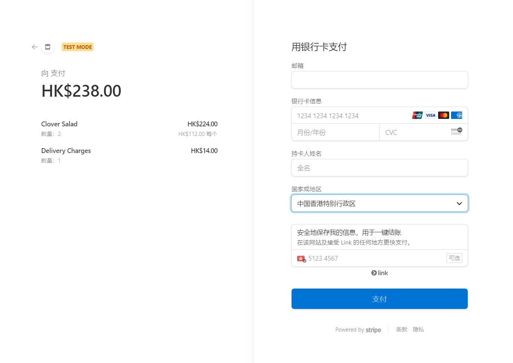

## This is a MERN project

**This is MERN project named food delivery. It has 3 platforms: 🔗[Frontend](https://food-delivery-frontend-8kro.onrender.com), 🔗[Backend](https://github.com/bigliuliu/food-delivery/tree/main/backend), 🔗[Admin](https://food-delivery-admin-o41w.onrender.com)**

## 🍲Features

- Stripe integration
- Fully responsive design
- Animated sections
- Smooth scrolling
- Dropdown menu
- CRUD
- Social media links

### 🌍HomePage

### 🛒Cart

### 🏡Address

### 💸Use Stripe for payment

## 🧰Technologies

- MongoDB
- React.js
- Node.js
- Express.js
- Toast
- Stripe